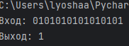
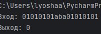

# finals1 

# 1.10  

## Задание
A={a, b, 0, 1}   
Определить, является ли слово P записью числа в двоичной системе счисления (непустым словом, состоящим только из цифр 0 и 1). Если да - вывод 1, иначе 0.

## Проделанная работа

Реализовал машину Тьюринга с использованием библиотеки `turing_machine`.    
Она проверяет каждый символ входного слова: если все символы принадлежат множеству (0, 1), то она очищает ленту и записывает 1, но  если встречается символ, не являющийся 0 или 1, машина стирает всю ленту и записывает 0.   

## Скриншоты

  

  

## Список использованных источников

[Документация truing_machine](https://github.com/dimazest/turing_machine/blob/master/Turing%20machine.ipynb)   
[Задачник по машинам Тьюринга и алгоритмам Маркова](https://cmcmsu.info/download/cmc.mt.markov.tasks.2016.pdf)
